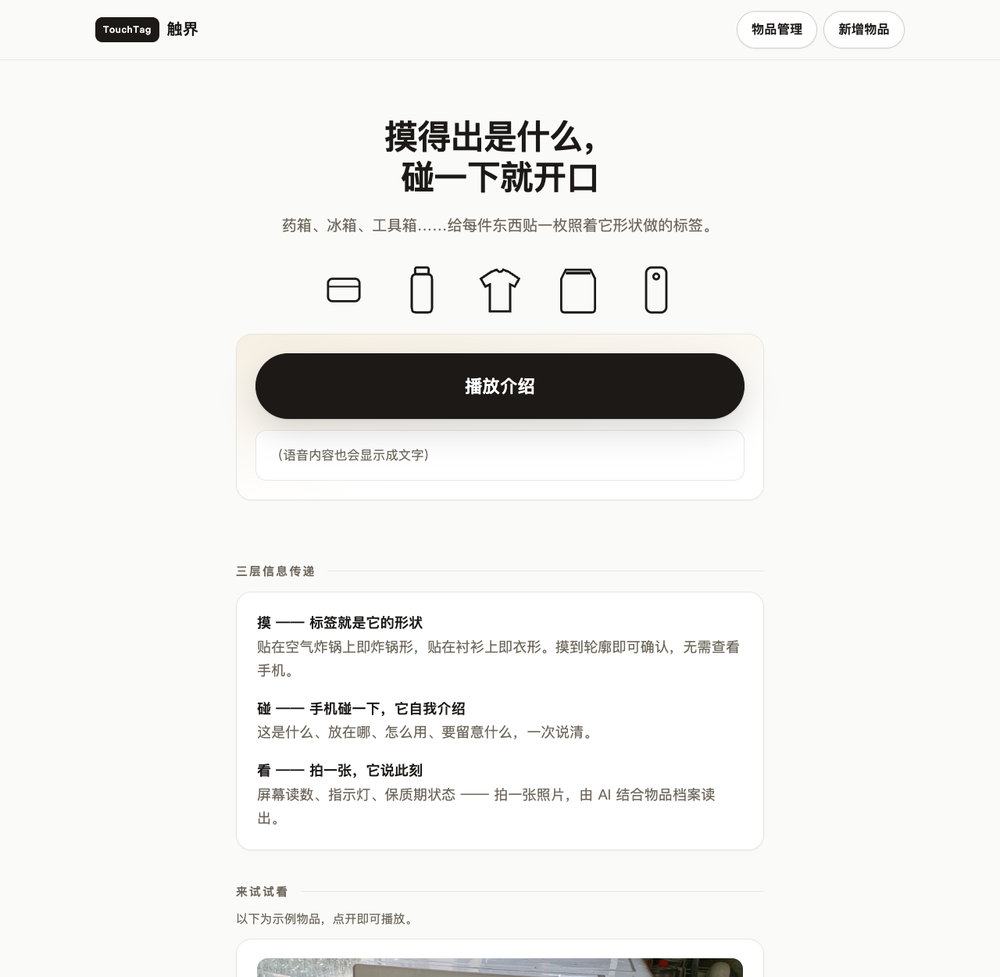
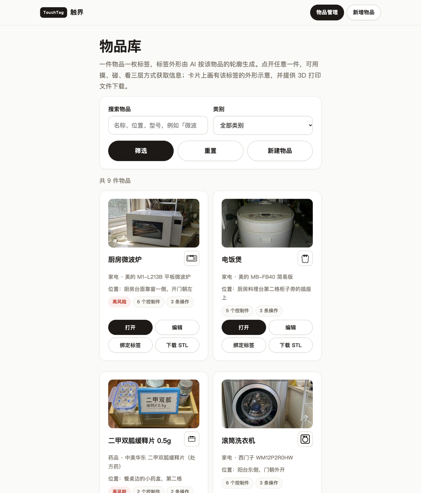
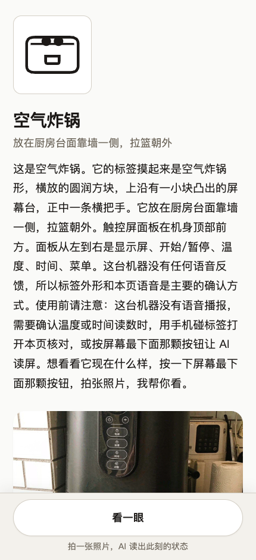
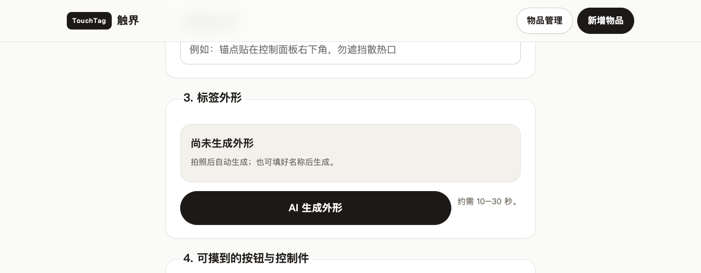
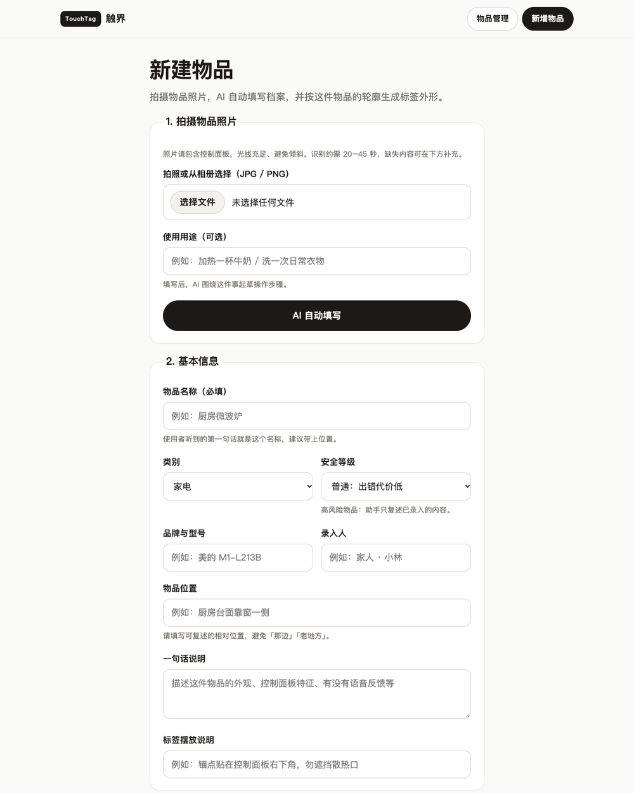

# 触界 TouchTag

**摸得出是什么，碰一下就开口。**



家电、药品、衣物上的界面，默认只为看得见的人设计：一排长得一样的按键、一张写着型号的标签。视障用户想自己用之前，得先有人替他把界面念一遍。

触界把「看界面」这件事，换成三层不依赖视觉的信息传递 —— **摸、碰、看**。

| 层 | 做什么 | 靠什么 |
|---|---|---|
| **摸** | 摸到轮廓就知道摸对了东西 | 贴在物品上的实体标签，外形取自该物品的轮廓（贴在空气炸锅上就是锅形） |
| **碰** | 手机碰一下，物品自我介绍 | NFC 标签里写的物品短链，打开页面即自动开口 |
| **看** | 拍一张照片，读出「此刻」 | 摄像头 + 视觉模型，结合该物品已确认的档案作答 |

第一层不需要手机，也不依赖网络：标签是 3D 打印出来的实体，摸形状就够了。

配套的配置端给家人和志愿者用 —— 拍一张设备照片，AI 把名称、按键位置、操作步骤尽量填好，填不出来的标红由人补；标签外形按这件物品实时生成，可下载 3D 打印文件；短链写进 NFC 后回读校验。

---

## 快速开始

```bash
cd TouchTag
node server.js
```

打开 <http://127.0.0.1:3000> 即可。可用 `--port` / `--host` 覆盖监听地址：

```bash
node server.js --port 8080 --host 0.0.0.0
```

**不需要 `npm install`。** 项目不含任何第三方依赖，只用 Node 内置模块（`http` / `fs` / `tls` / `crypto`），Node.js 18 以上即可。

首次启动会在 `data/` 下建立 JSON 存储，并载入 9 件带实拍照片的示例物品（空气炸锅、微波炉、滚筒洗衣机、电饭煲、长袖衬衫、二甲双胍缓释片、即食燕麦片、狼人杀身份卡、电视遥控器），方便直接演示。

### 不配置模型也能跑

大模型是可选的。未配置时应用照常工作，并如实标注降级状态，不会假装 AI 看过：

| 能力 | 未配置模型时 |
|---|---|
| 物品问答 | 退化为本地档案检索，只复述家人已确认的内容，不发明步骤 |
| 拍照自动填写 | 候选只来自类别模板，页面写明「没有看图」 |
| 标签外形生成 | 退回内置外形库，返回值里 `source` 标明来源 |
| 语音播报 | 默认可用（走 Edge TTS 公开接口，无需密钥） |

---

## 三层信息传递的落地



**第一层 · 摸。** 标签外形不是从固定清单里挑的，而是由模型按这件物品的照片（没有照片则按名称与说明）画出剪影轮廓，经 `lib/tactile.js` 重新解析、校验坐标、等比铺满后序列化，最终随物品入库。生成之后不再变化 —— 一枚标签打印出来贴到物品上，手感就必须永远一样。

**第二层 · 碰。** 标签里只写一条短链（`/i/<id>`），不带任何业务数据。页面打开后自动播放介绍：这是什么、标签摸起来什么样、放在哪、能问什么。不念型号 —— 型号是家人录入时核对用的，念出来只是噪音。

**第三层 · 看。** 拍下此刻，模型结合该物品的档案回答实时信息：屏幕读数、指示灯、里面还剩多少、过没过期。高风险类别（药品 / 加热 / 燃气）只描述事实，不给操作指令。

**使用端**（手机）——打开即自动播报，提问与「看一眼」各占一个大按钮。



**配置端**——标签外形按这件物品的照片或名称实时生成，生成之后随物品固定。



配置端的一次完整录入：拍一张设备照片，AI 把名称、按键位置、操作步骤尽量填好，填不出来的标红等人补。



---

## 页面

| 路由 | 页面 | 给谁用 |
|---|---|---|
| `/` | 首页 | 介绍三层信息传递，附示例物品入口 |
| `/i/:id`<br>`/ask/:id` | 物品页 | **盲人使用端**。外形大图、自动开始播报、语音提问、拍一张「看一眼」。整页只有两个大按钮 |
| `/items` | 物品库 | 配置端主界面。卡片列出实拍照片、标签外形缩略图、位置、控制件与操作数 |
| `/create` | 新增物品 | 拍照 → AI 自动填写 → 生成标签外形 → 补全控制件与操作步骤 |
| `/edit/:id` | 编辑物品 | 复用新增物品页；底部提供两步确认的删除入口 |
| `/bind/:id` | 绑定标签 | 写 NFC 短链并回读校验（Android Chrome 支持 Web NFC；iOS 需先用 NFC Tools 预写） |
| `/admin` | 运行状态 | 服务健康、模型与语音引擎配置、数据统计，未挂在导航上 |
| `/demo` | 演示脚本 | 现场演示流程与验收标准 |

---

## 配置

全部通过环境变量控制，一份完整模板见 [`deploy/touchtag.env.example`](deploy/touchtag.env.example)。

| 变量 | 说明 |
|---|---|
| `HOST` / `PORT` | 监听地址，默认 `127.0.0.1:3000`（生产环境应由 nginx 反代，不要直接暴露） |
| `TOUCHTAG_DATA_DIR` | 数据目录，默认 `./data` |
| `TOUCHTAG_BASE_URL` | 打印进 NFC 的短链前缀。留空则跟随访问者的域名 / IP，用 IP 访问和以后换域名都能自洽 |
| `TOUCHTAG_LLM_*` | 物品问答用的大模型（`BASE_URL` / `API_KEY` / `MODEL` / `MAX_TOKENS` / `EFFORT` / `TIMEOUT_MS`） |
| `TOUCHTAG_VLM_*` | 视觉理解用的**多模态**模型，同上六项；「看一眼」与拍照自动填写走这里 |
| `TOUCHTAG_SHAPE_*` | 标签外形生成，不单独配置时复用 VLM 或 LLM 配置 |
| `TOUCHTAG_TTS` / `TOUCHTAG_TTS_VOICE` | 服务器端语音，默认开启；`off` 则改用浏览器自带合成 |
| `TOUCHTAG_WARM_ON_BOOT` | 启动时预热语音缓存，设为 `off` 关闭 |

任何 OpenAI 兼容接口都可以接入（DeepSeek、通义千问、Moonshot、vLLM 等）。

> **推理模型的 token 预算要给足。** DeepSeek-V4.1-Flash 这类模型会先输出思考内容，且思考 token 计入 `max_tokens`。预算给小了会出现「HTTP 200 但正文为空」—— 看起来成功，实际什么也没答。`lib/chat.js` 统一处理了这个坑：只取 `message.content`，正文为空时抛出带诊断信息的错误交给上层兜底。

---

## HTTP 接口

| 方法 | 路径 | 说明 |
|---|---|---|
| GET | `/api/health` | 服务健康、各引擎启用状态 |
| GET | `/api/ai/selftest` | 真的打一次模型，确认密钥、额度、模型名 |
| GET | `/api/items` | 物品列表，支持 `q` / `category` / `safety` 过滤 |
| POST | `/api/items` | 新建物品 |
| GET / PATCH / DELETE | `/api/items/:id` | 读取 / 更新 / 删除（连同问答记录与磁盘照片一并清理） |
| POST | `/api/items/:id/photo` | 上传实拍照片，同一物品只保留最新一张 |
| GET | `/api/items/:id/stl` | 下载标签的 3D 打印文件（**演示占位件**，见下） |
| POST | `/api/items/:id/tags/:tagId/verify` | 回读确认 |
| POST | `/api/items/:id/look` | 第三层「看一眼」：拍下此刻，结合档案作答 |
| POST | `/api/ask` | 语音 / 文字提问 |
| POST | `/api/tag-shape` | 按照片或名称实时生成标签外形 |
| GET | `/api/tactile` | 内置外形库（首页轮廓条与生成不可用时的兜底） |
| GET | `/api/tts?text=&voice=` | 合成语音（mp3，磁盘缓存） |
| GET / POST | `/api/tts/warm` | 预热全站语音缓存，现场演示前跑一次 |
| GET | `/api/qa-logs` | 问答记录，用于回看使用者到底问了什么 |

---

## 目录结构

```
TouchTag/
├── server.js              零依赖 HTTP 服务：路由、接口、静态资源
├── lib/
│   ├── store.js           JSON 存储：物品、标签、问答记录
│   ├── seed.js            示例物品与示例数据
│   ├── tactile.js         触觉标签：外形库、几何校验与重新序列化、SVG 渲染
│   ├── shapegen.js        让模型按物品画出标签轮廓，收敛成一份外形 JSON
│   ├── ai.js              物品问答，接不上模型时退化到本地档案检索
│   ├── vision.js          配置端「看一次」与使用端「看一眼」
│   ├── chat.js            OpenAI 兼容接口的共用调用层（推理模型的坑都在这里处理）
│   ├── speech.js          播报文案的唯一来源，与预热缓存一一对应
│   ├── tts.js             服务器端神经网络语音（裸 TLS + 手写 WebSocket，零依赖）
│   └── stl.js             3D 打印文件输出
├── public/                前端页面与样式（原生 HTML/CSS/JS，无构建步骤）
├── deploy/                systemd 单元、nginx 站点、部署脚本、环境变量模板
├── docs/screenshots/      README 配图
└── data/                  运行时数据（JSON 存储、照片、语音缓存）
```

---

## 部署

```bash
bash deploy/deploy.sh
```

脚本打包 `server.js lib public deploy`（**不含 `data/`**，线上数据在 `/var/lib/touchtag`），上传后同步 systemd 与 nginx 配置并重启服务，最后做一次健康检查。

生产环境由 nginx 反代到 `127.0.0.1:3000`，systemd 以非 root 用户运行，`ProtectSystem=full` + `ReadWritePaths` 限制可写范围。语音接口单独关闭了 nginx 缓冲，让浏览器边下边播。

> 域名未备案时，中国大陆的运营商会按 Host 头拦截：带域名走 HTTP 会被中间设备直接 403，HTTPS 走域名 SNI 会被 reset。因此 `deploy/nginx-touchtag.conf` 有意**不做 http → https 强制跳转**，两个端口都直接提供应用，保留 IP 直连作为回退路径。

---

## 设计上的几个取舍

**外形生成后就固定。** 生成结果随物品入库（`item.tag_shape_custom`），此后不再变化。「重新生成」等于换一枚实体标签，需要重新打印 —— 这个代价只落在录入人身上，不影响使用者。已打印出来的标签与页面上的外形永远是同一个轮廓。

**模型返回的几何不直接进页面。** 模型只负责「画」，输出的一段 `path` 字符串会经 `sanitizeCustomShape` 只认白名单指令（`M L H V C Q Z`）重新解析，重算坐标、等比居中铺满后再序列化。任何不合规的轮廓都会退回内置外形。

**模型只给候选，入库必须人工确认。** 拍照自动填写出的控制件、操作步骤，`needs_confirmation` 恒为 `true`，必须逐条确认才能保存。高风险物品的助手只复述已确认内容，不做推理。

**播报文案在服务端生成。** 前端播放的文本必须与预热时完全一致，否则缓存永不命中。所以 `lib/speech.js` 是文案的唯一来源，物品创建 / 更新时顺手预合成音频。

**零依赖是硬约束。** 现场演示不能出现 `npm install` 失败。TTS 用裸 TLS 加手写 WebSocket 直接对接语音服务，STL 用 `Buffer` 手写二进制格式。

---

## 已知边界

- **3D 打印文件是演示占位件。** `lib/stl.js` 现在按外形给出一个不同长宽比的圆角方块，用来把「生成外形 → 下载 STL → 切片 → 打印」这条链路走通。真实版本应当把外形轮廓多边形化后沿 Z 轴挤出成实体。
- **NFC 写入有平台差异。** Android Chrome 的 Web NFC 可用，绑定页可直接写入；iOS 不支持 Web NFC，需要用 NFC Tools 一类的应用预写 NDEF。
- **标签只写短链。** 业务数据全在服务端，换内容不需要重新写标签。
- 问答与视觉理解都以模型可用为前提；模型不可用时全部降级为本地检索，并在页面上明确说明。
